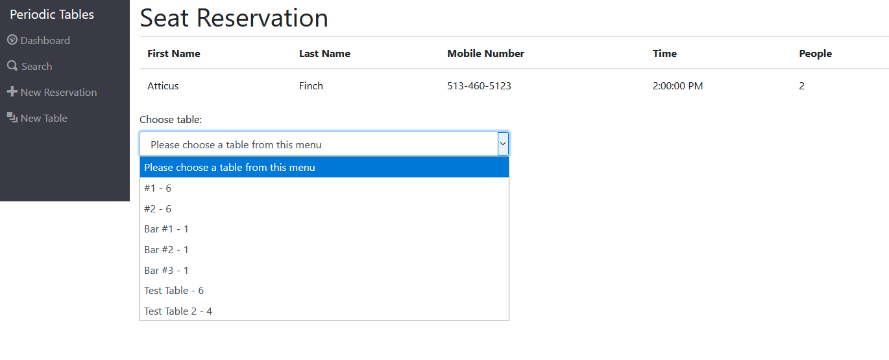

# Capstone: Restaurant Reservation System Frontend
#### Final Capstone Project for Thinkful Engineering Immersion Program

This is the front-end application for the final capstone project of the Thinkful Engineering Immersion Program. It allows its intended users (restaurant staff) to be able to create and manage reservations for their restaurant. 

## Links

* 
* 
* [Live Demo](https://periodic-tables-frontend-alpha.vercel.app/dashboard)

## Screenshots

### / , /reservations , /dashboard - Home Page

The home page for this application. By default, it shows the reservations for today, as well as the status of all tables.

### /reservations/new

This is the form to create a new reservation. Will not create a new reservation if the reservation is set for a Tuesday, a date/time in the past, or outside of the hours between 10:30 AM and 9:30 PM.

### /reservations/:reservation_id/edit

This uses the same form as the new reservation page, but loads the information from the selected reservation. Like the new reservation, it will not update the reservation if the date and time are outside of the acceptable parameters.

### /tables/new

This is the form to create a new table. A table must have a name of at least 2 characters, and have a capacity of at least 1.

### /reservations/:reservation_id/seat

When the seat button for a reservation on the dashboard is selected, the user is brought to this page. It shows some information regarding the reservation, as well as a select input with all the tables.

The select input lists all the tables. The reservation will only be seated if the table is available, and if the capacity of the table is greater than or equal to the number of people in the reservation.

### /search

The search page allows you to search for reservations by phone number. If the reservation is found, this appears. Reservations of all statuses can be found by the search page.

This is what displays if no numbers are found in the query.

### Cancel and Finish Reservations

A prompt is brought up when the cancel button for a reservation is clicked. If cancel is selected, nothing happens. If OK is selected, the status of the reservation is changed to "cancelled" and will no longer display on the dashboard.

A prompt is brought up when the finish button for a table is clicked. If cancel is selected, nothing happens. If OK is selected, the status of the reservation attached to the table is changed to "finished" and will no longer display on the dashboard, and the table's status will display as "free".

## Technology
#### Built with:
  * React, utilizing useState, useEffect, useParams, useHistory, Router
  * Bootstrap

#### API Interface:
  * Built to interface with back end server provided in folder back-end
